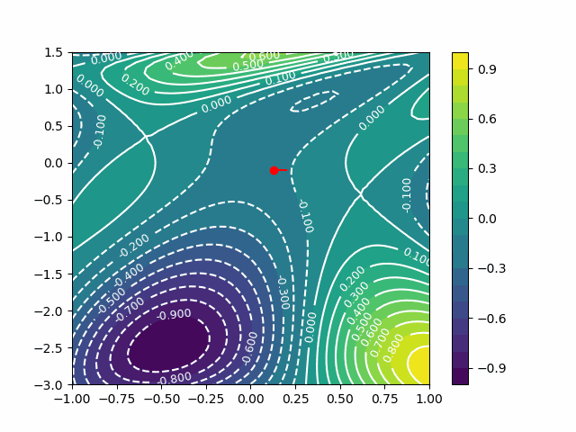

# Gradient Descent Animation (with LaTeX export)
This project presents some animations demonstrating 
[gradient descent algorithm](http://en.wikipedia.org/wiki/Gradient_descent).

You can choose whether you just want to see the animation or exporting a GIF or even saving a tikz plot 
ready to be included in your LaTeX documents.


```bash
> python3 gradient_descent_2d.py --help                         
usage: gradient_descent_2d.py [-h] [--animate] [--nsteps NSTEPS] [--good_init]
                              [--lr LR] [--save_gif] [--save_tikz]

optional arguments:
  -h, --help       show this help message and exit
  --animate        Animation with matplotlib
  --nsteps NSTEPS  Number of GD iterations
  --good_init      Whether to start from a good or bad initial point
  --lr LR          Learning rate
  --save_gif       Whether to save or not an animated GIF
  --save_tikz      Whether to save or not a tikz plot for LaTeX
```

Examples: 

```bash
# Start with a LR=0.1 and from a good initial point, 
# just plot the animation and exit
> python3 gradient_descend_2d.py --lr 0.1 --good_init
```

```bash
# Same as before, but now save the GIF and the tikzplot
> python3 gradient_descend_2d.py --lr 0.1 --good_init --save_gif --save_tikz
```



## LaTeX and Tikz disclaimer

If you want to use the resulting plot in a Beamer animation, you need to locate the last `\addplot` 
in the `.tex` file (which corresponds to the trajectory) and replace it with this header
```latex
\addplot [line width=1.25pt, red,forget plot,select coords between index={0}{\idx},
      unbounded coords=jump]
```
I know -- it sucks -- but it's the only way. 

An example of Beamer animation can be found in `presentation_example.tex`
but it's also reported here for convenience.
```latex
\begin{frame}[fragile]{}
  \centering
  \pgfplotsset{select coords between index/.style 2 args={
        x filter/.code={
            \ifnum\coordindex<#1\def\pgfmathresult{}\fi
            \ifnum\coordindex>#2\def\pgfmathresult{}\fi
          }
      }}

  \setlength\figureheight{.55\textwidth}
  \setlength\figurewidth{.55\textwidth}
  %  Looping, autoplaying at 4 frames per sec
  \begin{animateinline}[loop,autoplay]{4}    
    %  Animate first 15 frames
    \multiframe{15}{idx=1+1}{                
      \input{figs/gd_bad_init.tex}
    }
  \end{animateinline}

\end{frame}
```

In `./tikz/` you already have two prepared figures that can be directly imported in our LaTeX project (if you need it).

If you don't care about animating the trajectory, you can just use the resulting `.tex` as it is.
Refer to [tikzplotlib](https://github.com/nschloe/tikzplotlib) for additional details and options for exporting 
matplotlib figures for LaTeX.


### Acknowledgements
If you use or intent to use these scripts for you documents or keynotes, please consider to 
acknowledge the Author ([Simone Rossi](srossi93.gitlab.io)).